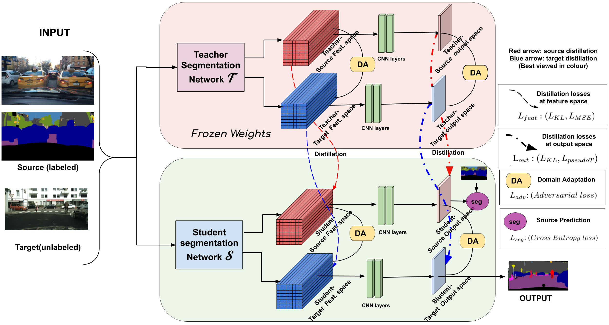

### Paper - [**Domain Adaptive Knowledge Distillation for Driving Scene Semantic Segmentation**](https://arxiv.org/abs/2011.08007)

Please cite our paper if you find it useful.

```
@inproceedings{kothandaramandomain,
  title={Domain Adaptive Knowledge Distillation for Driving Scene Semantic Segmentation},
  author={Kothandaraman, Divya and Nambiar, Athira and Mittal, Anurag},
  booktitle={Proceedings of the IEEE/CVF Winter Conference on Applications of Computer Vision},
  pages={134--143}
}
```

Table of Contents
=================

  * [Paper - <a href="https://arxiv.org/abs/2011.08007" rel="nofollow"><strong>Domain Adaptive Knowledge Distillation for Driving Scene Semantic Segmentation</strong></a>](#paper---Domain-Adaptive-Knowledge-Distillation-for-Driving-Scene-Semantic-Segmentation)
  * [**Repo Details and Contents**](#repo-details-and-contents)
     * [Code structure](#code-structure)
     * [Datasets](#datasets)
     * [Dependencies](#dependencies)
  * [**Our network**](#our-network)
  * [**Acknowledgements**](#acknowledgements)

## Repo Details and Contents
Python version: 3.7

### Code structure

**Dataoaders** - The dataloaders can be found in the 'dataset' folder, along with the image lists.<br>
**Models**  - Contains code for the network architectures <br>
**Utils** - Contains code for the cross entropy loss function
#### Training
train_gta2cs_multi_drnd38, train_gta2cs_multi_drnd22 - Training script for teacher and undistilled student networks <br>
train_gta2cs_ts_multi.py - Training script for the domain adaptive knowledge distillation network <br>
#### Evaluation
eval_cs.py - Contains the evaluation script for cityscapes <br>

### Datasets
* [**CityScapes**](https://www.cityscapes-dataset.com/) 
* [**Berkeley Deep Drive**](https://bdd-data.berkeley.edu/) 
* [**GTA5**](https://download.visinf.tu-darmstadt.de/data/from_games/) 

### Dependencies
PyTorch <br>
NumPy <br>
SciPy <br>
Matplotlib <br>

## Our network

<p align="center">

</p>

## Acknowledgements

This code is heavily borrowed from [**AdaptSegNet**](https://github.com/wasidennis/AdaptSegNet)
